# Voice-Enabled Task Tracker

A full-stack task management application with voice input capabilities, user authentication, and email notifications. Users can create projects, manage tasks via Kanban board or list view, and create tasks using voice commands with intelligent date/priority parsing.

## Table of Contents

- [Features](#features)
- [Feature Breakdown](#feature-breakdown)
- [Tech Stack](#tech-stack)
- [Getting Started](#getting-started)
  - [Prerequisites](#prerequisites)
  - [Backend Setup](#backend-setup)
  - [Frontend Setup](#frontend-setup)
- [Usage](#usage)
- [API Reference](#api-reference)
- [Database Schema](#database-schema)
- [Project Structure](#project-structure)
- [Future Scope](#future-scope)

---

## Features

### 1. User Registration
Sign up with email and password. Password must meet security requirements: minimum 8 characters, uppercase, lowercase, number, and special character. Real-time validation feedback is provided.

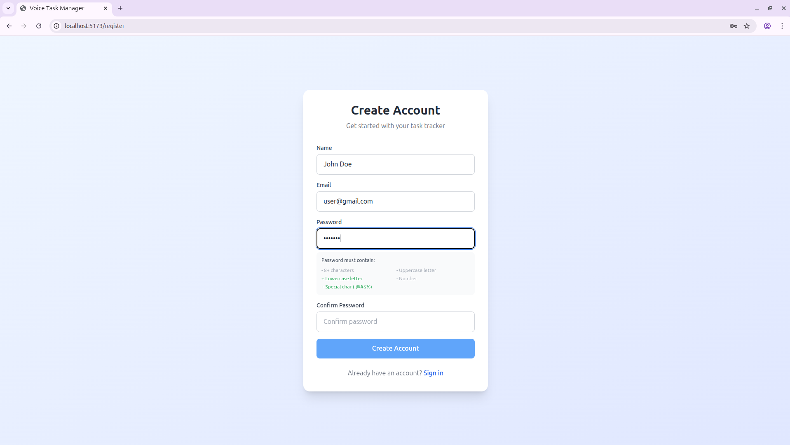

### 2. User Login
Secure login with email and password. JWT-based authentication with 7-day token expiry.

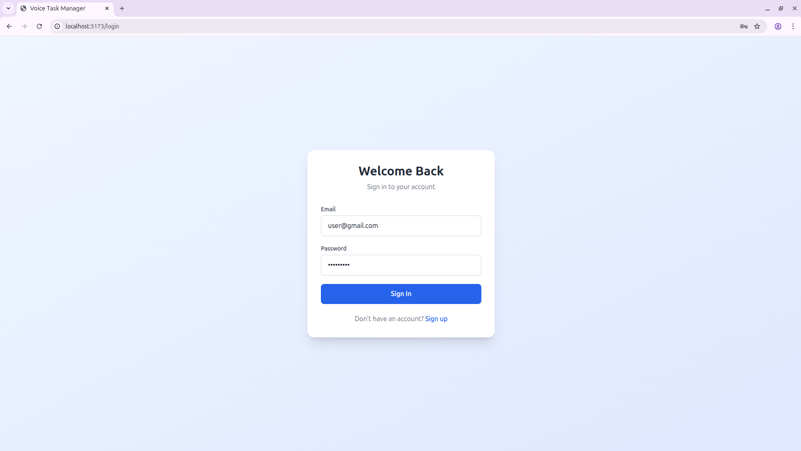

### 3. Home Page
View all your projects at a glance. First-time users see an empty state with a prompt to create their first project.

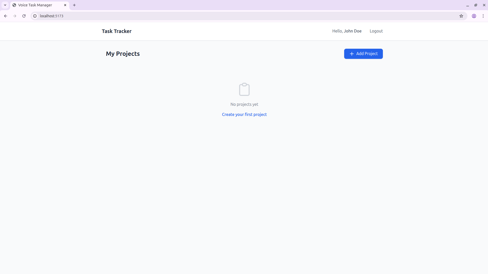

### 4. Create Project
Create a new project with a name and optional description.

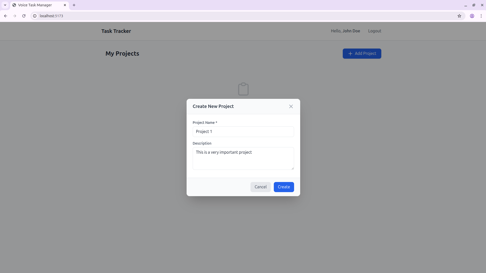

### 5. Edit Project
Edit an existing project's name or description by clicking the edit icon on hover.

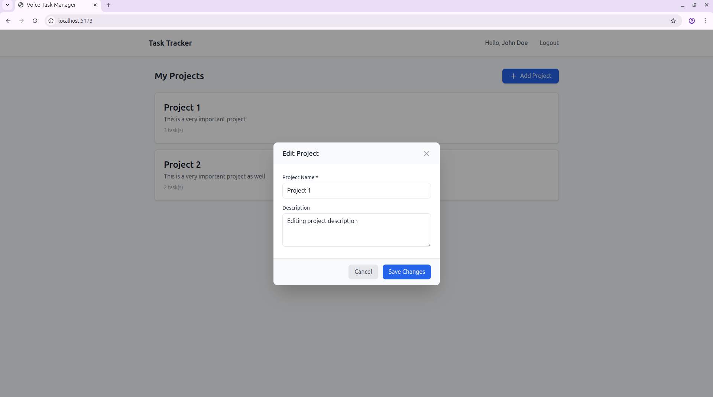

### 6. Delete Project
Delete a project with a confirmation warning. Deleting a project will also delete all tasks associated with it.

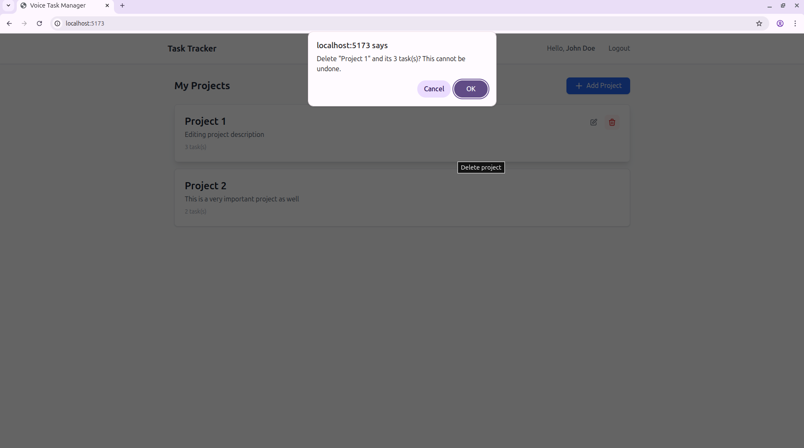

### 7. Project List
All projects are displayed with their task count. Hover over a project card to reveal edit and delete options.

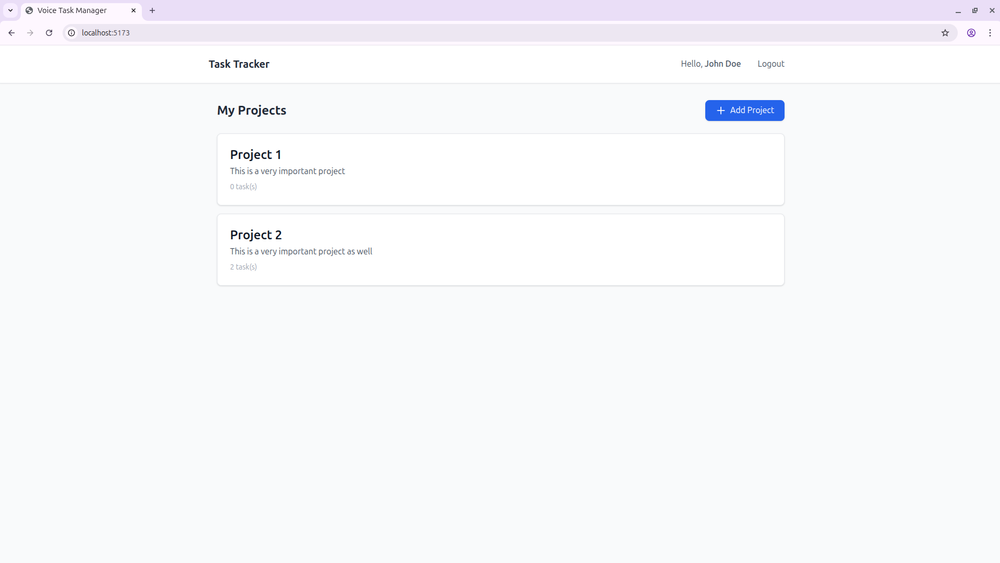

### 8. Project Dashboard
Click on a project to enter the project view. Default view is the Kanban board style. Add and manage tasks from here. You can also go back to the Project List view using the "Back to Projects" button.

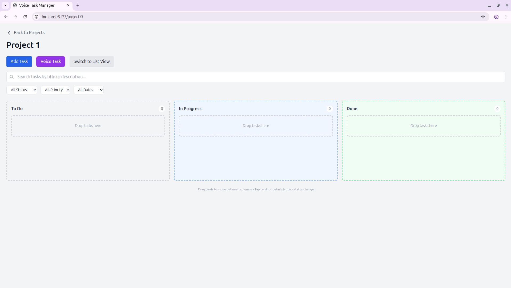

### 9. Voice Task Creation
Create tasks using voice commands. The system:
- Transcribes your speech and displays it for verification
- Intelligently extracts task details from natural language
- Understands relative dates like "tomorrow", "next Monday", "in 3 days"
- Detects priority keywords like "urgent", "high priority", "critical"
- Defaults to "TO DO" status and "MEDIUM" priority if not specified
- Allows editing before final creation

**Example:** "Remind me to send the project proposal to the client by next Wednesday, it's high priority"

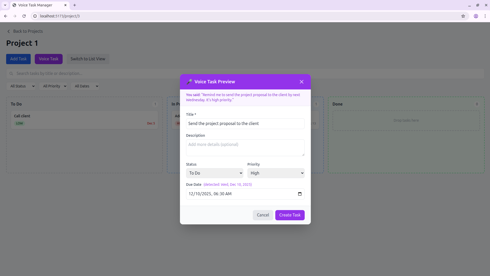

### 10. Manual Task Creation
Create tasks manually with full control over all fields: title, description, status, priority, and due date.

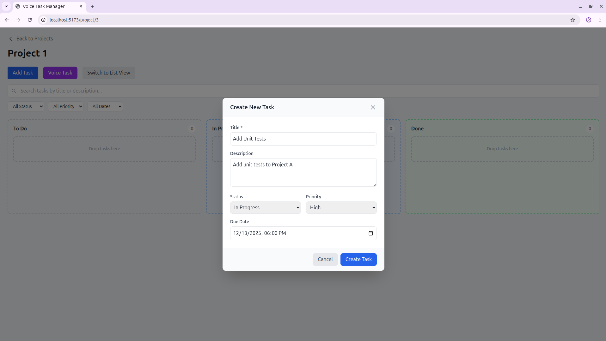

### 11. Edit Task
Click on any task to view and edit its details. The last updated timestamp is displayed on the task.


### 12. Delete Task
Delete tasks with a confirmation prompt to prevent accidental deletion.


### 13. Search and Filter
Search tasks by keywords in title or description. Filter by one or more criteria:
- Status (To Do, In Progress, Done)
- Priority (Low, Medium, High)
- Due Date (Overdue, Today, This Week, No Date)

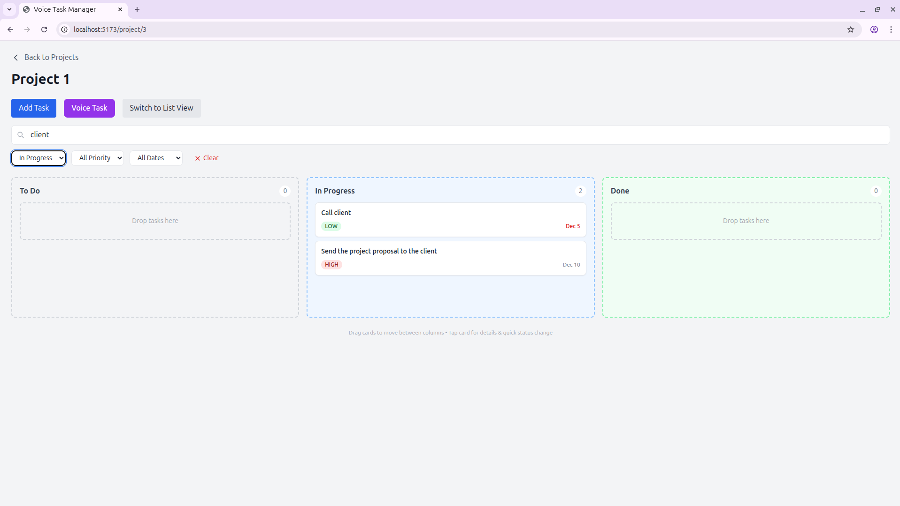

### 14. Kanban Board View
Default view with drag-and-drop functionality. Move tasks between columns (To Do, In Progress, Done) by dragging. Touch support available for mobile devices.

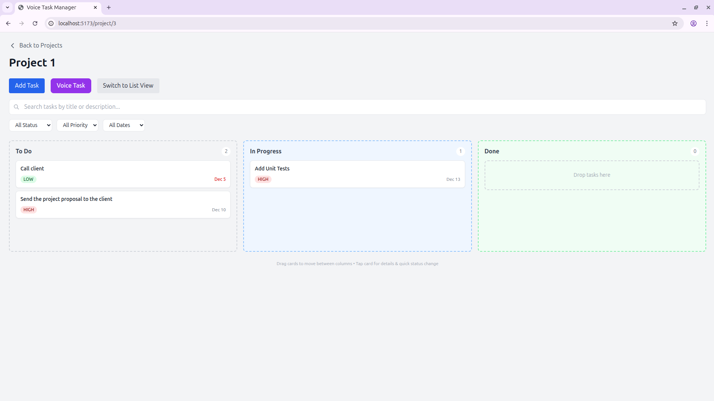

### 15. List View
Alternative table view showing all task details in a structured format. Click on any row to view/edit the task.


### 16. Overdue Indicators and Quick Status Change
Tasks with past due dates are highlighted in red in both views. Click on a task to quickly change its status using the "Move to" buttons.

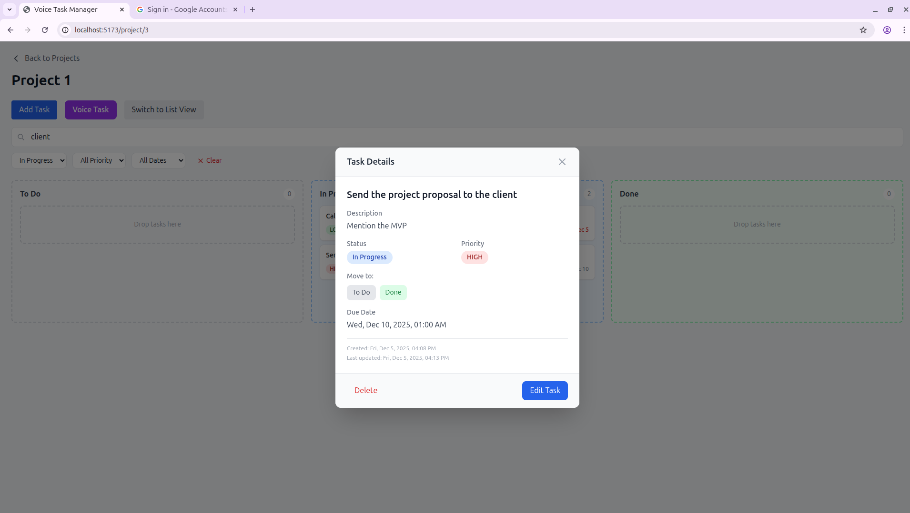

### 17. Email Notifications
Automated email notifications are sent via Mailtrap for:
- Task created
- Task updated (with list of changes)
- Task status changed
- Task deleted

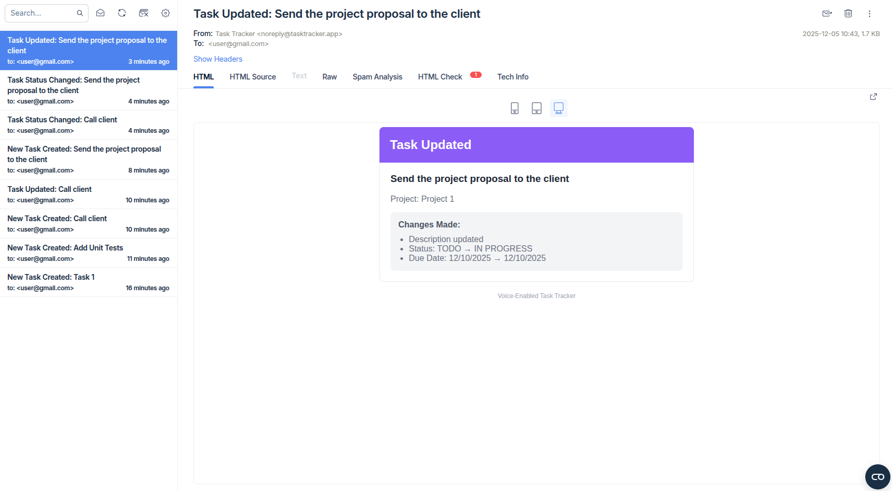

### 18. Responsive Design
The application is fully responsive and works on mobile devices. The Kanban board supports touch-based drag-and-drop for moving tasks between columns on tablets and phones.

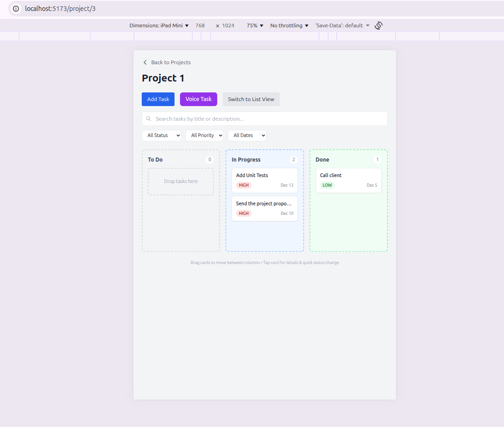

---

## Feature Breakdown

### Task Management
- Create, Read, Update, Delete tasks
- Fields: Title, Description, Due Date, Priority, Status
- Priority levels: LOW, MEDIUM, HIGH
- Status options: TODO, IN_PROGRESS, DONE
- Timestamps: createdAt, updatedAt

### Project Management
- Create, Edit, Delete projects
- Each project contains multiple tasks
- Projects are user-scoped (each user sees only their projects)
- Cascade delete (deleting project removes all its tasks)

### User Authentication
- User registration with email/password
- Password hashing with bcrypt
- JWT-based authentication (7-day token expiry)
- Protected routes - users can only access their own data
- Password requirements:
  - Minimum 8 characters
  - At least one uppercase letter
  - At least one lowercase letter
  - At least one number
  - At least one special character (!@#$%^&*)

### Views
- **Kanban Board View**: Drag-and-drop tasks between columns
- **List View**: Table format with all task details
- Responsive design with touch support for mobile

### Voice Input
- Microphone button to start/stop recording
- Local speech-to-text using Whisper model
- Intelligent NLP parsing for dates using chrono-node
- Extracts: Title, Due Date, Priority from spoken text
- Recognizes relative dates: "tomorrow", "next Monday", "in 3 days"
- Detects priority keywords: "urgent", "high priority", "critical"
- Preview modal to review/edit before creating task

### Search and Filtering
- Search tasks by title or description
- Filter by Status, Priority, Due Date
- Clear all filters button

### Email Notifications
- Task Created, Updated, Deleted notifications
- Status change notifications
- HTML email templates via Mailtrap

---

## Tech Stack

### Frontend
| Technology | Purpose |
|------------|---------|
| React 18 | UI Framework |
| Vite | Build Tool |
| Tailwind CSS | Styling |
| React Router v6 | Routing |
| React Context API | State Management |

### Backend
| Technology | Purpose |
|------------|---------|
| Node.js | Runtime |
| Express.js | Web Framework |
| Drizzle ORM | Database ORM |
| SQLite | Database |
| JWT | Authentication |
| bcryptjs | Password Hashing |
| Nodemailer | Email Service |

### Voice Processing
| Technology | Purpose |
|------------|---------|
| @xenova/transformers | Local Whisper Model |
| chrono-node | Date Parsing |
| ffmpeg-static | Audio Conversion |

---

## Getting Started

### Prerequisites

- Node.js (v18 or higher)
- npm (comes with Node.js)
- Git

### Backend Setup

1. Navigate to the backend folder:
   ```bash
   cd backend
   ```

2. Install dependencies:
   ```bash
   npm install
   ```

3. Create a `.env` file in the backend folder:
   ```env
   PORT=5000
   JWT_SECRET=your-secret-key-here-change-in-production
   
   # For email notifications (sign up at https://mailtrap.io)
   MAILTRAP_USER=your-mailtrap-username
   MAILTRAP_PASS=your-mailtrap-password
   ```

4. Initialize the database:
   ```bash
   npx drizzle-kit push
   ```

5. Start the backend server:
   ```bash
   npm run dev
   ```
   
   Backend will run on `http://localhost:5000`

### Frontend Setup

1. Open a new terminal and navigate to the frontend folder:
   ```bash
   cd frontend
   ```

2. Install dependencies:
   ```bash
   npm install
   ```

3. Start the frontend development server:
   ```bash
   npm run dev
   ```
   
   Frontend will run on `http://localhost:5173`

---

## Usage

1. Open `http://localhost:5173` in your browser
2. Register a new account
3. Create your first project
4. Start adding tasks

### Voice Commands

The voice feature uses your browser's microphone. On first use, allow microphone access when prompted. The Whisper model downloads automatically on first use (~50MB).

**Example voice commands:**
- "Remind me to send the project proposal to the client by next Wednesday, high priority"
- "Review code changes, urgent, by December 13th"
- "Call the team tomorrow morning"

---

## Database Schema

### Users Table
| Column | Type | Constraints |
|--------|------|-------------|
| id | INTEGER | PRIMARY KEY, AUTO INCREMENT |
| email | TEXT | NOT NULL, UNIQUE |
| password | TEXT | NOT NULL (hashed) |
| name | TEXT | NOT NULL |
| created_at | INTEGER | Unix timestamp |

### Projects Table
| Column | Type | Constraints |
|--------|------|-------------|
| id | INTEGER | PRIMARY KEY, AUTO INCREMENT |
| name | TEXT | NOT NULL |
| description | TEXT | DEFAULT "" |
| user_id | INTEGER | FK -> users.id, NOT NULL |
| created_at | INTEGER | Unix timestamp |

### Tasks Table
| Column | Type | Constraints |
|--------|------|-------------|
| id | INTEGER | PRIMARY KEY, AUTO INCREMENT |
| title | TEXT | NOT NULL |
| description | TEXT | DEFAULT "" |
| priority | TEXT | DEFAULT "MEDIUM" |
| status | TEXT | DEFAULT "TODO" |
| due_date | INTEGER | NULLABLE, Unix timestamp |
| project_id | INTEGER | FK -> projects.id |
| created_at | INTEGER | Unix timestamp |
| updated_at | INTEGER | Unix timestamp |

### Enums
- **Priority**: LOW, MEDIUM, HIGH
- **Status**: TODO, IN_PROGRESS, DONE

### Relationships
- User (1) -> Projects (Many)
- Project (1) -> Tasks (Many)

---

## API Reference

### Authentication
| Method | Endpoint | Description |
|--------|----------|-------------|
| POST | `/auth/register` | Register new user |
| POST | `/auth/login` | Login user |
| GET | `/auth/me` | Get current user |

### Projects (Protected)
| Method | Endpoint | Description |
|--------|----------|-------------|
| GET | `/projects` | Get all projects for user |
| GET | `/projects/:id` | Get single project with tasks |
| POST | `/projects` | Create new project |
| PUT | `/projects/:id` | Update project |
| DELETE | `/projects/:id` | Delete project (cascades to tasks) |

### Tasks (Protected)
| Method | Endpoint | Description |
|--------|----------|-------------|
| GET | `/tasks` | Get all tasks (with filters) |
| GET | `/tasks/:id` | Get single task |
| POST | `/tasks` | Create new task |
| PUT | `/tasks/:id` | Update task |
| DELETE | `/tasks/:id` | Delete task |

### Voice (Protected)
| Method | Endpoint | Description |
|--------|----------|-------------|
| POST | `/voice/transcribe` | Upload audio, returns transcript + parsed task |

---

## Future Scope

- Assignee/Reporter fields on tasks
- Task dependencies (Depends On, Blocked By)
- Team/workspace shared collaboration
- Unit tests
- Task attachments
- Add tags to group similar tasks

---

## Notes

- All timestamps are stored as Unix timestamps (seconds since epoch)
- Passwords are hashed using bcrypt with salt rounds = 10
- SQLite doesn't support native enums, so priority/status are stored as TEXT
- Cascade delete is implemented in application code
- JWT tokens expire after 7 days
- Due dates are optional and default to null if not specified
- The Ideation folder in this repo contains the initial design though process
